# Elise

Elise est avant tout un projet pour une maison ultra connecté mais aussi un bot discord !

## Fonctionnalités disponible sur le portfolio
- [x] [Inventory.js](Commande/Inventory.js) : Schéma Mongo pour gérer un inventaire dans une base de donnée
- [x] [/start](Commande/start.js) : S'enregistrer afin de pouvoir jouer
- [x] [/connect](Commande/connect.js) : Pouvoir se connecter à son compte joueur
- [x] [/orderflow](Commande/orderflow.js) : Pour différente transaction entre le portefeuille, la banque, ou avec un autre joueur
- [x] [/wallet](Commande/wallet.js) : Pouvoir visualiser les montants en banque et dans le portefeuille
- [x] [<sugg](Commande/sugg.js) : Pour Proposer une suggestion

## Utilisation
Elise utilise MongoDB.js pour sa base de donnée et principalement les `slashCommand` Sur discord ce sont des commands comme `/command` ou l'on peut mettre des argument si besoin `/command argument argument`
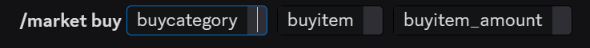

Ici la commande `/market buy` pour exemple, est une commande ou vous pouvez y trouver les arguments `buycategory` qui permet de choisir dans quelle catégorie se trouve l'item que vous voulez acheter, `buyitem` qui est l'argument ou vous pourrez sélectionner l'item que vous voulez acheter et enfin `buyitem_amount` pour définir combien de fois vous voulez acheter l'item en question.

La commande `<sugg` est une commande "normale" avec un préfixe pré-défini "<", sans lui ça serais considéré comme un message comme les autres, sauf exception ([messageCreate.js](Commande/messageCreate.js)). Elle permet aux joueurs de suggérer des améliorations ou des changements dans un certain salon.

Pour la base de donnée Mongo utilise des Schéma comme celui de [Inventory.js](Commande/Inventory.js) qui va gérer l'inventaire et créer les différents tuples pour chaque joueur.

### [/start](Commande/start.js)
Une fois la commande `/start` faites, vous avez un mini règlement qui s'affiche avec un bouton pour s'enregistrer
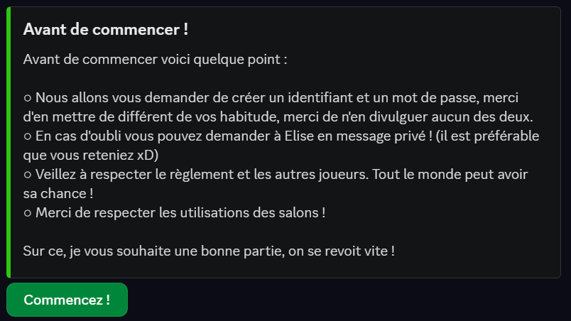

Une fois que vous avez cliquer, un modal apparaît (une pop-up)
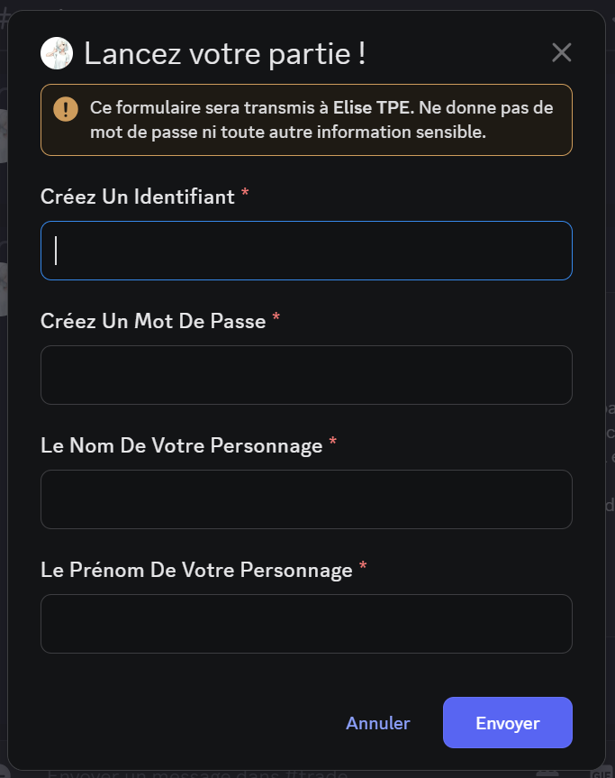

Ici vous y entrerez un identifiant, un mot de passe, le nom et le prénom du personnage que vous jouerez (pour une meilleure immersion dans le rp). L'identifiant et le mot de passe sont pour plus tard un site pour un marché plus dinamyque et plus simple pour les joueurs que faire plusieurs fois la même commande pour des items différents.

### [/connect](Commande/connect.js)
Une fois enregistrer, et une fois par semaine grâce à la bibliothèque node-cron qui déconnecte le joueur dans la nuit de dimanche à lundi à minuit, il vous faudra faire la commande pour vous connecter et pouvoir jouer, sans ça vous ne pourrez pas faire les différentes commandes lié au jeu
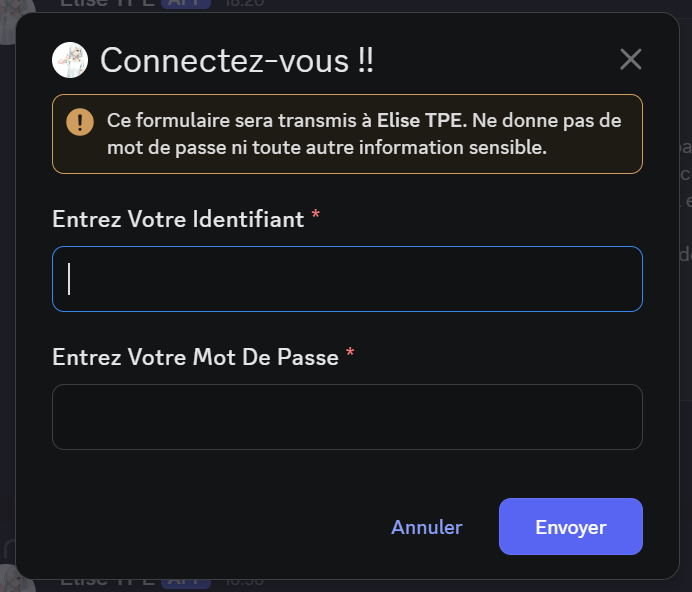

Ainsi, une fois connecté, vous aurez accès à toutes les commandes disponibles.

### [/orderflow](Commande/orderflow.js) et [/wallet](Commande/wallet.js)
Vous pourrez faire naviguer votre argent entre votre banque et votre portefeuille avec les différents arguments
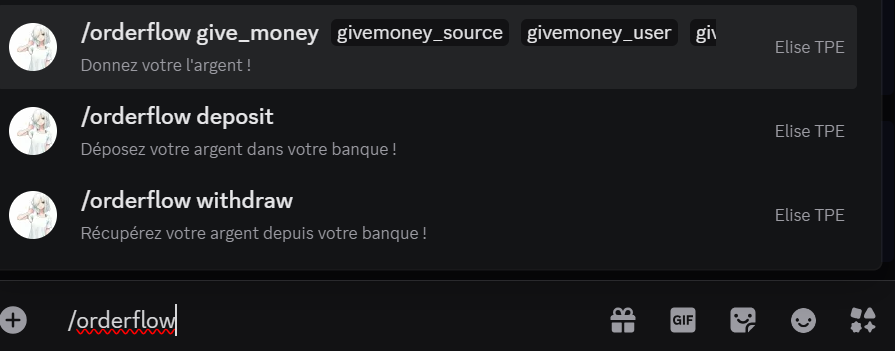

Avec la commande `/orderflow deposit` vous pourrez déposer votre argent en banque.
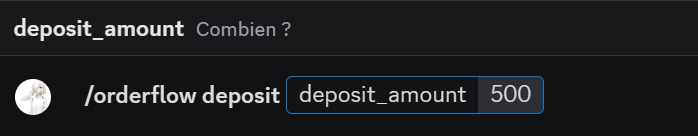
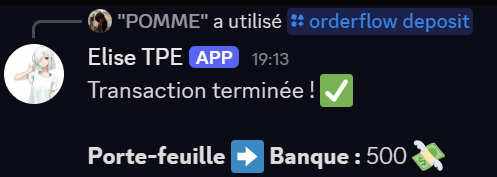

Avec la commande `/orderflow withdraw` vous pourrez retirer votre argent en banque.
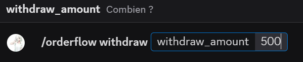
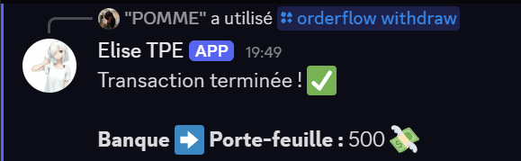

Avec la commande `/orderflow give_money` vous pourrez donner de l'argent à un autre joueur
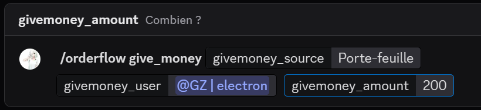

Et vous pouvez visualiser le tout avec la commande `/wallet`
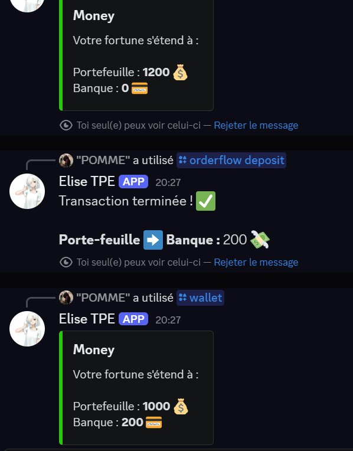

## Technologies Utilisées
- Langage de programmation : JavaScript
- Bibliothèques / Packages : discord.js, node-cron, path, fs, mongoose

