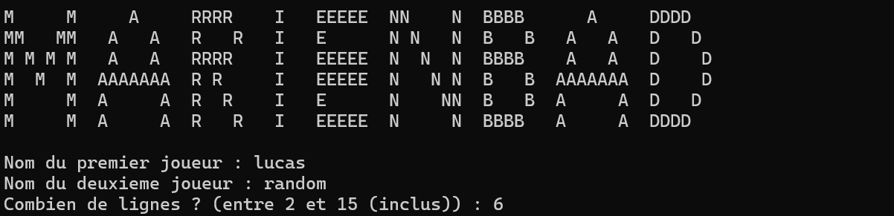
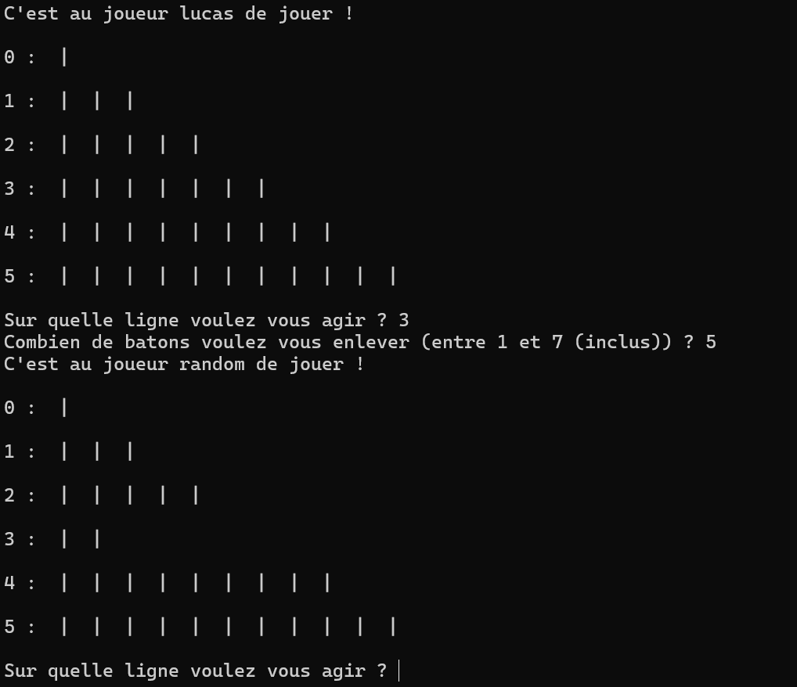
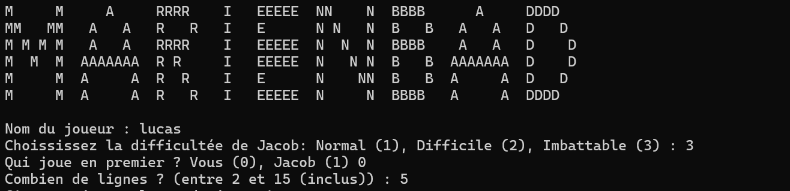
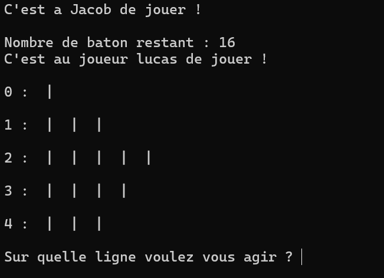

# Marienbad

Marienbad est un dérivé du jeu de Nim ou le but est de récupérer le dernier bâton !

## Fonctionnalités
- [x] MarienbadJvsJ : jouer contre un autre joueur
- [x] MarienbadJvsO : jouer contre le robot (Jacob)

## Installation (linux / wsl) depuis le dossier Marienbad

1. Clone le portfolio :
   ```sh
   git clone https://github.com/P0MM3BLANCH3/portfolio.git
   ```
2. Installe les dépendances (depuis le fichier `src`) :
   ```sh
   javac -d class src/*.java
   ```
3. Lance l'application :
   ```sh
   java -cp class Start MarienbadJvsJ
   ou
   java -cp class Start MarienbadJvsO
   ```

## Utilisation
### Joueur contre Joueur
Une fois lancé, choisissez les pseudos des deux joueurs et le nombre de ligne sur lequel vous voulez jouer


Ensuite le jeu commence et le joueur 1 joue en premier, il choisira sur quelle ligne il veut agir, et combien de bâtons il veut enlever, quand ce sera au joueur 2 de jouer, la même chose lui sera demandé, et ainsi de suite


### Joueur contre Robot (Jacob)
Une fois lancé, choisissez votre pseudo, la difficulté de Jacob, le nombre de ligne avec lequel vous voulez jouer, et qui jouera en premier entre vous et Jacob


Ensuite le jeu commence, celui qui est désigné comme premier joueur choisi la ligne sur laquelle il agira et le nombre de bâtons qu'il enlèvera, ensuite Jacob jouera et vous indiquera le nombre de bâtons restant et ainsi de suite



## Technologies Utilisées
- Langage de programmation : Java

